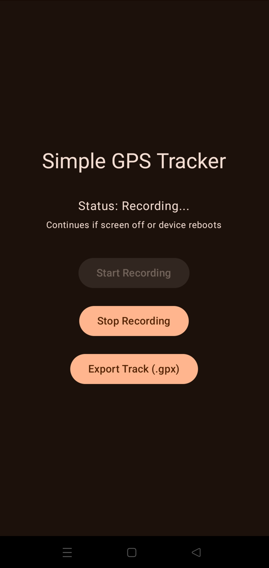

# 📍 Simple GPS Tracker for Android


A lightweight, privacy‑focused GPS tracker for Android. No maps, no ads, no permissions beyond location. Just start, record, and export your track as a standard `.gpx` file.

## ✨ Features

- 🎯 **One‑tap recording**: Start/Stop buttons with instant feedback
- 📤 **GPX export**: Share or save tracks in universal GPS Exchange Format
- 🧠 **Smart interpolation**: Automatically fills gaps >15s with time‑based linear interpolation (marks synthetic points)
- 🔋 **Background & screen‑off tracking**: Foreground service keeps GPS alive even when the app is minimized or the screen is locked
- 🔄 **Crash recovery**: Points auto‑saved every 10 seconds; resumes seamlessly after app kill or system restart
- 🚀 **Boot persistence**: Auto‑resumes tracking after device reboot (if recording was active)
- 🔒 **Privacy first**: No analytics, no cloud, no tracking beyond your own coordinates
- 🎨 **Modern UI**: Jetpack Compose, light‑mode optimized, Material 3 design

## 🛠 Tech Stack

- **Language**: Kotlin
- **UI**: Jetpack Compose (Material 3)
- **Location**: Google Play Services `FusedLocationProviderClient`
- **Persistence**: JSON file + `SharedPreferences` for state
- **Architecture**: Foreground Service + Repository pattern
- **Min SDK**: 26 (Android 8.0) • **Target SDK**: 34 (Android 14)

## ⚙️ Setup & Build

1. Clone the repo:
   ```bash
   git clone  https://github.com/xelasaed-crypto/GpsTracker.git
   cd GpsTracker
   ```
   
2. Open in Android Studio (Giraffe or newer recommended)
3. Sync Gradle and build:
   ```bash
   ./gradlew assembleDebug
   ```

4. Install on a real device (emulators lack reliable GPS):
   ```bash
    ./gradlew installDebug
   ```
    
5. Grant permissions when prompted:
  - Location (Fine + Coarse)
  - Background Location (second prompt)
  - Notifications (Android 13+)

### 📱 Usage

1. Tap Start Recording → a persistent notification appears
2. Walk, run, or drive — tracking continues even with screen off
3. Tap Stop Recording → track is interpolated and saved as .gpx
4. Tap Export Track → share via email, cloud, or open in any GPX viewer

|💡 Tip: For uninterrupted tracking on Xiaomi/Huawei/Oppo devices, disable battery optimization 
for this app in Settings → Apps → GPS Tracker → Battery → Unrestricted.


### 🗂 Project Structure

```
app/
├── src/main/java/com/example/gpstracker/
│   ├── MainActivity.kt          # Compose UI + permission flow
│   ├── service/
│   │   └── LocationTrackerService.kt  # Foreground tracking logic
│   ├── receiver/
│   │   └── BootReceiver.kt      # Auto‑resume after reboot
│   ├── model/
│   │   └── GpsPoint.kt          # Data class for coordinates
│   └── util/│       
├── InterpolationEngine.kt  # Gap‑filling algorithm
│       ├── GpxExporter.kt          # GPX file writer
│       └── TrackPersistence.kt     # Crash‑safe JSON storage
```

### 🔐 Permissions Explained

| Permission   | Why it's needed |
| ------------ | --------------- |
| ACCESS_FINE_LOCATION |High‑accuracy GPS coordinates |
|ACCESS_COARSE_LOCATION |Fallback when GPS is unavailable |
|ACCESS_BACKGROUND_LOCATION |Continue tracking when app is not visible |
|FOREGROUND_SERVICE_LOCATION | Android 14+ requirement for background location |
| POST_NOTIFICATIONS | Android 13+ requirement for the tracking notification |
|RECEIVE_BOOT_COMPLETED | Resume tracking after device reboot |

### 🤝 Contributing

Contributions are welcome! Please:
1. Fork the repo
2. Create a feature branch (git checkout -b feat/amazing-feature)
3. Commit your changes (git commit -m 'Add amazing feature')
4. Push to the branch (git push origin feat/amazing-feature)
5. Open a Pull Request

### 📜 License

Distributed under the MIT License. See LICENSE for details.
Built with ❤️ for hikers, cyclists, and anyone who wants to own their location data.

---



